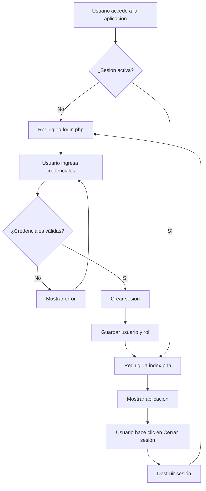

# Sistema de Autenticación

El sistema INVENTO utiliza autenticación basada en sesiones PHP para controlar el acceso y gestionar roles de usuario. Esta guía explica cómo funciona el sistema de login, logout y control de acceso.

## Inicio de Sesión

### Formulario de Login

El sistema presenta un formulario de login simple que solicita dos campos:

<Steps>
  <Step title="Acceder a la página de login">
    Navega a `http://localhost/inventario/auth/login.php` en tu navegador.
  </Step>
  
  <Step title="Ingresar credenciales">
    Completa los campos requeridos:
    - **Correo**: Dirección de email del usuario registrado
    - **Contraseña**: Contraseña asociada a la cuenta
  </Step>
  
  <Step title="Enviar formulario">
    Haz clic en el botón **Ingresar** para autenticarte.
  </Step>
</Steps>

### Estructura del Formulario

El formulario de login (`auth/login.php:42-50`) utiliza los siguientes campos:

```php auth/login.php
<form method="POST">
    <label>Correo:</label><br>
    <input type="email" name="correo" required><br><br>

    <label>Contraseña:</label><br>
    <input type="password" name="password" required><br><br>

    <button type="submit" name="login">Ingresar</button>
</form>
```

## Proceso de Autenticación

Cuando se envía el formulario, el sistema ejecuta el siguiente proceso:

### 1. Validación de Credenciales

El código en `auth/login.php:5-27` realiza la autenticación:

```php auth/login.php
if (isset($_POST['login'])) {
    $correo = $_POST['correo'];
    $password = $_POST['password'];

    $sql = "SELECT * FROM usuarios WHERE correo = '$correo'";
    $resultado = $conn->query($sql);

    if ($resultado->num_rows == 1) {
        $usuario = $resultado->fetch_assoc();

        // COMPARACIÓN DIRECTA (por ahora)
        if ($password == $usuario['contraseña']) {
            $_SESSION['usuario'] = $usuario['nombre'];
            $_SESSION['rol'] = $usuario['rol'];
            header("Location: ../index.php");
            exit();
        } else {
            $error = "Contraseña incorrecta";
        }
    } else {
        $error = "Usuario no encontrado";
    }
}
```

<Warning>
  **Nota de Seguridad**: El sistema actualmente utiliza comparación directa de contraseñas en texto plano. En producción, se recomienda usar `password_hash()` y `password_verify()` para mayor seguridad. Consulta la [guía de configuración](/configuration) para más detalles sobre seguridad de contraseñas.
</Warning>

### 2. Creación de Sesión

Si las credenciales son válidas, el sistema crea una sesión con dos variables importantes:

- **`$_SESSION['usuario']`**: Almacena el nombre del usuario autenticado
- **`$_SESSION['rol']`**: Almacena el rol ("Admin" o "Empleado")

Estas variables de sesión se utilizan en todo el sistema para verificar la autenticación y controlar el acceso.

### 3. Redirección

Después de autenticarse exitosamente, el usuario es redirigido a la página principal (`index.php`).

## Mensajes de Error

El sistema muestra mensajes específicos según el tipo de error:

<Accordion title="Usuario no encontrado">
  Se muestra cuando el correo electrónico ingresado no existe en la base de datos. Verifica que:
  - El correo esté escrito correctamente
  - El usuario haya sido creado previamente en la tabla `usuarios`
</Accordion>

<Accordion title="Contraseña incorrecta">
  Se muestra cuando el correo es válido pero la contraseña no coincide. Verifica que:
  - La contraseña esté escrita correctamente
  - No haya espacios adicionales
  - Las mayúsculas y minúsculas coincidan exactamente
</Accordion>

## Protección de Páginas

Todas las páginas del sistema están protegidas con un control de sesión. Por ejemplo, en `index.php:1-8`:

```php index.php
<?php
session_start();

if (!isset($_SESSION['usuario'])) {
    header("Location: auth/login.php");
    exit();
}
?>
```

Este código:
1. Inicia la sesión PHP con `session_start()`
2. Verifica si existe la variable `$_SESSION['usuario']`
3. Si no existe (usuario no autenticado), redirige al login
4. Si existe, permite el acceso a la página

<Tip>
  Todas las páginas del sistema deben incluir este código al inicio para asegurar que solo usuarios autenticados puedan acceder.
</Tip>

## Mostrar Información del Usuario

Una vez autenticado, puedes mostrar información del usuario en cualquier página:

```php
<h1>Bienvenido, <?php echo $_SESSION['usuario']; ?></h1>
<p>Rol: <?php echo $_SESSION['rol']; ?></p>
```

Esto es útil para:
- Personalizar la interfaz con el nombre del usuario
- Mostrar u ocultar funcionalidades según el rol
- Auditar acciones realizadas por usuarios específicos

## Cierre de Sesión

Para cerrar la sesión, el sistema proporciona un enlace en cada página:

```php
<a href="auth/logout.php">Cerrar sesión</a>
```

El archivo `auth/logout.php` realiza las siguientes acciones:

```php auth/logout.php
<?php
session_start();
session_destroy();
header("Location: login.php");
exit();
?>
```

Este código:
1. Inicia la sesión para poder acceder a ella
2. Destruye todas las variables de sesión con `session_destroy()`
3. Redirige al usuario de vuelta al formulario de login

<Note>
  Es importante llamar a `session_start()` antes de `session_destroy()` para que PHP pueda acceder a la sesión actual.
</Note>

## Roles de Usuario

El sistema soporta dos roles:

<CardGroup cols={2}>
  <Card title="Admin" icon="user-shield" color="#4A90E2">
    Acceso completo a todas las funcionalidades del sistema:
    - Crear, editar y eliminar productos
    - Registrar entradas y salidas
    - Gestionar usuarios (futuro)
  </Card>
  <Card title="Empleado" icon="user" color="#6BA3E8">
    Acceso limitado a operaciones básicas:
    - Ver productos
    - Registrar movimientos de inventario
    - Sin permisos para eliminar
  </Card>
</CardGroup>

<Info>
  Actualmente, el sistema almacena el rol pero no implementa restricciones específicas por rol. Consulta la [guía de roles de usuario](/guides/user-roles) para más detalles sobre cómo implementar control de acceso basado en roles.
</Info>

## Flujo Completo de Autenticación



## Seguridad de Sesiones

Para mejorar la seguridad del sistema de autenticación:

<Steps>
  <Step title="Regenerar ID de sesión después del login">
    ```php
    session_regenerate_id(true);
    ```
    Esto previene ataques de fijación de sesión.
  </Step>
  
  <Step title="Establecer tiempo de expiración de sesión">
    ```php
    // En cada página protegida
    if (isset($_SESSION['LAST_ACTIVITY']) && 
        (time() - $_SESSION['LAST_ACTIVITY'] > 1800)) {
        session_destroy();
        header("Location: auth/login.php");
        exit();
    }
    $_SESSION['LAST_ACTIVITY'] = time();
    ```
    Las sesiones expirarán después de 30 minutos de inactividad.
  </Step>
  
  <Step title="Usar HTTPS en producción">
    Configura tu servidor para usar SSL/TLS y establece:
    ```php
    ini_set('session.cookie_secure', 1);
    ini_set('session.cookie_httponly', 1);
    ```
  </Step>
</Steps>

## Solución de Problemas

<Accordion title="La sesión no persiste entre páginas">
  Verifica que:
  - Todas las páginas tengan `session_start()` al inicio
  - No haya salida antes de `session_start()` (ni espacios ni HTML)
  - La configuración de PHP tenga habilitada `session.auto_start` o uses `session_start()` manualmente
</Accordion>

<Accordion title="Error: Cannot modify header information">
  Este error ocurre cuando intentas usar `header()` después de enviar contenido al navegador. Asegúrate de que:
  - `session_start()` esté en la primera línea del archivo PHP
  - No haya espacios o saltos de línea antes de `<?php`
  - No uses `echo` antes de `header()`
</Accordion>

<Accordion title="Las credenciales correctas no funcionan">
  Verifica que:
  - El usuario exista en la tabla `usuarios`
  - La contraseña en la base de datos coincida exactamente (incluyendo mayúsculas/minúsculas)
  - La conexión a la base de datos sea exitosa
  - Revisa los errores de MySQL con `$conn->error`
</Accordion>

## Próximos Pasos

<CardGroup cols={2}>
  <Card title="Gestión de Productos" icon="box" href="/guides/product-management">
    Aprende a crear, editar y eliminar productos
  </Card>
  <Card title="Roles de Usuario" icon="users" href="/guides/user-roles">
    Entiende cómo funcionan los permisos por rol
  </Card>
  <Card title="Configuración" icon="gear" href="/configuration">
    Configura opciones de seguridad avanzadas
  </Card>
  <Card title="Solución de Problemas" icon="wrench" href="/reference/troubleshooting">
    Resuelve problemas comunes de autenticación
  </Card>
</CardGroup>
