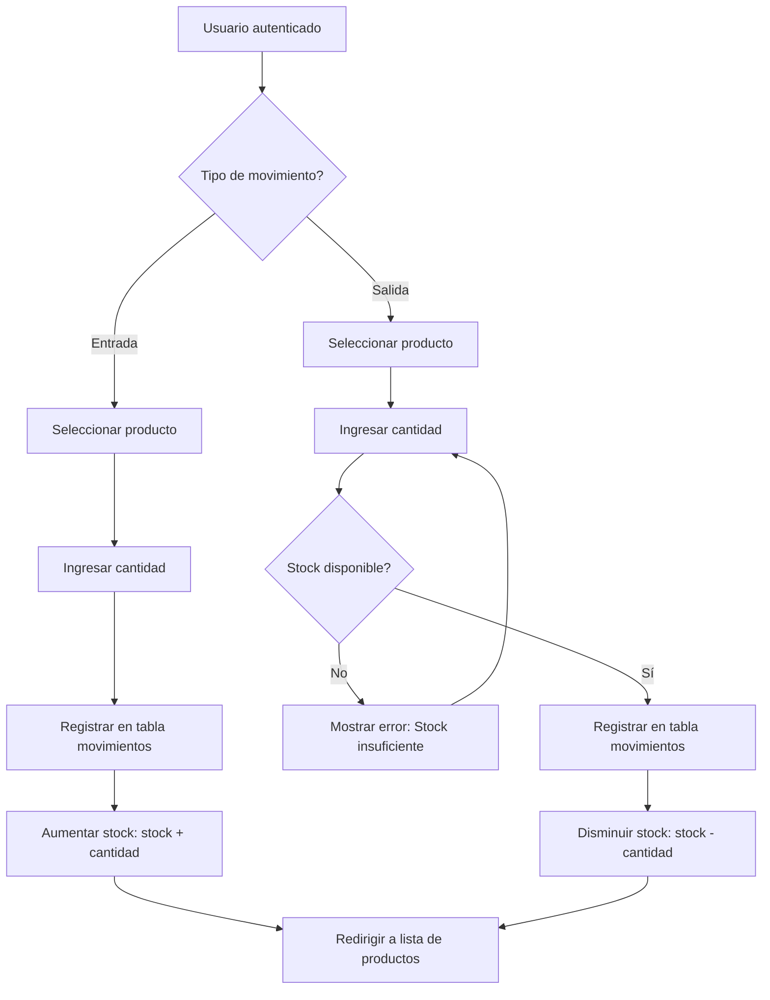

# Movimientos de Inventario

El módulo de movimientos de inventario permite registrar las entradas (compras, devoluciones de clientes) y salidas (ventas, devoluciones a proveedores) de productos, actualizando automáticamente el stock disponible.

<Info>
  Los movimientos de inventario son la única forma de modificar el stock de productos en el sistema. Esto garantiza trazabilidad completa de todos los cambios de inventario.
</Info>

## Tipos de Movimientos

El sistema soporta dos tipos de movimientos:

<CardGroup cols={2}>
  <Card title="Entrada" icon="arrow-down" color="#28a745">
    **Aumenta el stock** de un producto
    
    Ejemplos:
    - Compra a proveedores
    - Devoluciones de clientes
    - Producción interna
    - Ajustes por conteo físico (positivos)
  </Card>
  
  <Card title="Salida" icon="arrow-up" color="#dc3545">
    **Disminuye el stock** de un producto
    
    Ejemplos:
    - Ventas a clientes
    - Devoluciones a proveedores
    - Productos dañados/pérdidas
    - Ajustes por conteo físico (negativos)
  </Card>
</CardGroup>

## Registrar Entrada

Las entradas aumentan el stock de un producto y se registran en la tabla `movimientos` para trazabilidad.

### Proceso de Entrada

<Steps>
  <Step title="Acceder al formulario de entrada">
    Desde la lista de productos, haz clic en **Entrada** en la barra de navegación superior, o navega a `http://localhost/inventario/movimientos/entrada.php`.
  </Step>
  
  <Step title="Seleccionar producto">
    Usa el menú desplegable para seleccionar el producto al que deseas agregar stock. El sistema muestra todos los productos disponibles.
  </Step>
  
  <Step title="Ingresar cantidad">
    Especifica la cantidad de unidades a agregar. Debe ser un número entero positivo mayor o igual a 1.
  </Step>
  
  <Step title="Registrar entrada">
    Haz clic en **Registrar Entrada**. El sistema:
    - Creará un registro en la tabla `movimientos` con tipo "entrada"
    - Aumentará el stock del producto seleccionado
    - Te redirigirá a la lista de productos con el stock actualizado
  </Step>
</Steps>

### Formulario de Entrada

El formulario en `movimientos/entrada.php:27-41` permite seleccionar el producto y cantidad:

```php movimientos/entrada.php
<form method="POST">
    Producto:<br>
    <select name="producto_id" required>
        <?php while ($p = $productos->fetch_assoc()) { ?>
            <option value="<?= $p['id'] ?>">
                <?= $p['nombre'] ?>
            </option>
        <?php } ?>
    </select><br><br>

    Cantidad:<br>
    <input type="number" name="cantidad" min="1" required><br><br>

    <button name="registrar">Registrar Entrada</button>
</form>
```

### Procesamiento de la Entrada

Cuando se envía el formulario, el código en `movimientos/entrada.php:7-22` procesa la entrada:

```php movimientos/entrada.php
if (isset($_POST['registrar'])) {
    $producto_id = $_POST['producto_id'];
    $cantidad = $_POST['cantidad'];

    // Registrar movimiento
    $conn->query("INSERT INTO movimientos (producto_id, tipo, cantidad)
                  VALUES ($producto_id, 'entrada', $cantidad)");

    // Aumentar stock
    $conn->query("UPDATE productos 
                  SET stock = stock + $cantidad 
                  WHERE id = $producto_id");

    header("Location: ../productos/listar.php");
    exit();
}
```

<Note>
  **Transacciones atómicas**: El sistema realiza dos operaciones separadas (INSERT en movimientos y UPDATE en productos). En producción, considera usar transacciones SQL para garantizar que ambas operaciones se completen o ninguna se ejecute:
  
  ```php
  $conn->begin_transaction();
  try {
      // INSERT y UPDATE aquí
      $conn->commit();
  } catch (Exception $e) {
      $conn->rollback();
      // Manejar error
  }
  ```
</Note>

## Registrar Salida

Las salidas disminuyen el stock de un producto, con validación automática de stock disponible.

### Proceso de Salida

<Steps>
  <Step title="Acceder al formulario de salida">
    Desde la lista de productos, haz clic en **Salida** en la barra de navegación superior, o navega a `http://localhost/inventario/movimientos/salida.php`.
  </Step>
  
  <Step title="Seleccionar producto">
    Usa el menú desplegable para seleccionar el producto del que deseas retirar stock.
  </Step>
  
  <Step title="Ingresar cantidad">
    Especifica la cantidad de unidades a retirar. Debe ser un número entero positivo.
    
    <Warning>
      El sistema validará que haya suficiente stock disponible antes de procesar la salida.
    </Warning>
  </Step>
  
  <Step title="Registrar salida">
    Haz clic en **Registrar Salida**. Si hay stock suficiente, el sistema:
    - Creará un registro en la tabla `movimientos` con tipo "salida"
    - Disminuirá el stock del producto seleccionado
    - Te redirigirá a la lista de productos
    
    Si no hay stock suficiente, mostrará un error "Stock insuficiente".
  </Step>
</Steps>

### Formulario de Salida

El formulario en `movimientos/salida.php:36-50` es similar al de entrada:

```php movimientos/salida.php
<form method="POST">
    Producto:<br>
    <select name="producto_id" required>
        <?php while ($p = $productos->fetch_assoc()) { ?>
            <option value="<?= $p['id'] ?>">
                <?= $p['nombre'] ?>
            </option>
        <?php } ?>
    </select><br><br>

    Cantidad:<br>
    <input type="number" name="cantidad" min="1" required><br><br>

    <button name="registrar">Registrar Salida</button>
</form>
```

### Validación de Stock Disponible

La característica clave de las salidas es la validación de stock (`movimientos/salida.php:7-29`):

```php movimientos/salida.php
if (isset($_POST['registrar'])) {
    $producto_id = $_POST['producto_id'];
    $cantidad = $_POST['cantidad'];

    // Obtener stock actual
    $producto = $conn->query(
        "SELECT stock FROM productos WHERE id=$producto_id"
    )->fetch_assoc();

    if ($producto['stock'] >= $cantidad) {
        // Registrar movimiento
        $conn->query("INSERT INTO movimientos (producto_id, tipo, cantidad)
                      VALUES ($producto_id, 'salida', $cantidad)");

        // Disminuir stock
        $conn->query("UPDATE productos 
                      SET stock = stock - $cantidad 
                      WHERE id = $producto_id");

        header("Location: ../productos/listar.php");
        exit();
    } else {
        $error = "Stock insuficiente";
    }
}
```

<Tip>
  **Prevención de stock negativo**: La validación de stock asegura que nunca tendrás stock negativo en tu inventario, lo cual es esencial para mantener datos confiables.
</Tip>

## Estructura de la Tabla Movimientos

Cada movimiento registrado contiene la siguiente información:

<ParamField path="id" type="integer" required>
  Identificador único del movimiento. Clave primaria auto-incremental.
</ParamField>

<ParamField path="producto_id" type="integer" required>
  ID del producto relacionado. Clave foránea que referencia `productos.id`.
</ParamField>

<ParamField path="tipo" type="enum('entrada','salida')" required>
  Tipo de movimiento: "entrada" (aumenta stock) o "salida" (disminuye stock).
</ParamField>

<ParamField path="cantidad" type="integer" required>
  Cantidad de unidades del movimiento. Siempre es un número positivo.
</ParamField>

<ParamField path="fecha" type="timestamp">
  Fecha y hora en que se registró el movimiento. Se establece automáticamente al valor actual con `DEFAULT CURRENT_TIMESTAMP`.
</ParamField>

## Actualización Automática de Stock

El stock de productos se actualiza automáticamente con cada movimiento:

<Tabs>
  <Tab title="Entrada (Aumentar)">
    ```sql
    UPDATE productos 
    SET stock = stock + [cantidad] 
    WHERE id = [producto_id]
    ```
    
    **Ejemplo**: Si un producto tiene stock de 10 y registras una entrada de 5 unidades:
    - Stock anterior: 10
    - Entrada: +5
    - Stock nuevo: 15
  </Tab>
  
  <Tab title="Salida (Disminuir)">
    ```sql
    UPDATE productos 
    SET stock = stock - [cantidad] 
    WHERE id = [producto_id]
    ```
    
    **Ejemplo**: Si un producto tiene stock de 15 y registras una salida de 3 unidades:
    - Stock anterior: 15
    - Salida: -3
    - Stock nuevo: 12
  </Tab>
</Tabs>

## Consultar Historial de Movimientos

Aunque el sistema actualmente no incluye una interfaz para consultar el historial, puedes ver todos los movimientos directamente en la base de datos:

```sql
SELECT 
    m.id,
    p.nombre AS producto,
    p.codigo,
    m.tipo,
    m.cantidad,
    m.fecha
FROM movimientos m
INNER JOIN productos p ON m.producto_id = p.id
ORDER BY m.fecha DESC;
```

Esta consulta te mostrará:
- Qué producto fue movido
- Si fue entrada o salida
- Cuántas unidades
- Cuándo ocurrió el movimiento

<Tip>
  **Mejora recomendada**: Crear una página `movimientos/historial.php` que muestre esta información en una tabla amigable, con filtros por producto, tipo de movimiento y rango de fechas.
</Tip>

## Casos de Uso Comunes

<Accordion title="Registrar una compra a proveedor">
  1. Navega a **Entrada**
  2. Selecciona el producto comprado
  3. Ingresa la cantidad recibida
  4. Registra la entrada
  
  El stock del producto aumentará automáticamente.
</Accordion>

<Accordion title="Registrar una venta">
  1. Navega a **Salida**
  2. Selecciona el producto vendido
  3. Ingresa la cantidad vendida
  4. Registra la salida
  
  Si hay stock suficiente, se procesará la salida. Si no, verás un error.
</Accordion>

<Accordion title="Ajuste de inventario por conteo físico">
  Si realizas un conteo físico y encuentras discrepancias:
  
  **Si encontraste más stock del registrado:**
  - Usa **Entrada** para ajustar la diferencia positiva
  
  **Si encontraste menos stock del registrado:**
  - Usa **Salida** para ajustar la diferencia negativa
  
  Ejemplo: Sistema muestra 50 unidades, conteo físico encuentra 47
  - Registra una salida de 3 unidades para ajustar
</Accordion>

<Accordion title="Productos dañados o pérdidas">
  Si tienes productos dañados o perdidos que no se pueden vender:
  1. Navega a **Salida**
  2. Selecciona el producto afectado
  3. Ingresa la cantidad de unidades dañadas/perdidas
  4. Registra la salida
  
  Considera agregar un campo "motivo" en la tabla movimientos para distinguir ventas de pérdidas.
</Accordion>

## Flujo de Movimientos de Inventario



## Mejoras Recomendadas

<CardGroup cols={2}>
  <Card title="Página de historial" icon="clock-rotate-left">
    Crear una interfaz para consultar y filtrar todos los movimientos registrados con detalles completos.
  </Card>
  
  <Card title="Campo de motivo/notas" icon="note-sticky">
    Agregar un campo opcional para documentar el motivo de cada movimiento (venta, devolución, ajuste, etc.).
  </Card>
  
  <Card title="Usuario que registró" icon="user">
    Registrar qué usuario (`$_SESSION['usuario']`) realizó cada movimiento para auditoría completa.
  </Card>
  
  <Card title="Mostrar stock actual" icon="chart-line">
    En los formularios de entrada/salida, mostrar el stock actual de cada producto junto a su nombre.
  </Card>
  
  <Card title="Movimientos masivos" icon="boxes-stacked">
    Permitir registrar múltiples productos en un solo movimiento (útil para compras con varios artículos).
  </Card>
  
  <Card title="Alertas de stock bajo" icon="bell">
    Mostrar una alerta cuando el stock de un producto caiga por debajo de un mínimo configurado.
  </Card>
</CardGroup>

## Solución de Problemas

<Accordion title="Error: Stock insuficiente (pero el stock parece suficiente)">
  Verifica:
  - Que el stock en la base de datos coincida con el mostrado en la interfaz
  - Que otro usuario no haya registrado una salida simultáneamente
  - Ejecuta `SELECT stock FROM productos WHERE id=X` directamente en MySQL para confirmar el stock real
  
  Si hay inconsistencia, puede deberse a:
  - Edición manual de la tabla productos (sin pasar por movimientos)
  - Errores en transacciones anteriores que no completaron ambas operaciones
</Accordion>

<Accordion title="Los movimientos se registran pero el stock no cambia">
  Esto puede ocurrir si:
  - La consulta UPDATE tiene un error de sintaxis (revisa `$conn->error`)
  - El usuario MySQL no tiene permisos UPDATE en la tabla productos
  - La columna `stock` no existe o tiene un nombre diferente
  - Hay un trigger en la base de datos que interfiere con el UPDATE
  
  Ejecuta las consultas manualmente en phpMyAdmin para identificar el problema.
</Accordion>

<Accordion title="El historial de movimientos no se guarda">
  Si la tabla movimientos no registra los movimientos:
  - Verifica que la tabla `movimientos` exista en la base de datos
  - Confirma que la consulta INSERT no tiene errores (revisa `$conn->error`)
  - Verifica permisos INSERT del usuario MySQL
  - Revisa que `producto_id` sea una clave foránea válida
</Accordion>

<Accordion title="Stock negativo después de una salida">
  Si logras registrar una salida que deja stock negativo:
  - La validación de stock puede tener un error lógico
  - Puede haber una condición de carrera (race condition) con múltiples usuarios
  
  **Solución temporal**: Ejecuta un UPDATE para corregir:
  ```sql
  UPDATE productos SET stock = 0 WHERE stock < 0;
  ```
  
  **Solución permanente**: Agrega una restricción CHECK en MySQL 8.0+:
  ```sql
  ALTER TABLE productos ADD CONSTRAINT stock_no_negativo CHECK (stock >= 0);
  ```
</Accordion>

## Reportes e Informes

Puedes generar reportes útiles consultando la tabla de movimientos:

<Tabs>
  <Tab title="Productos más movidos">
    ```sql
    SELECT 
        p.nombre,
        p.codigo,
        COUNT(*) as total_movimientos,
        SUM(CASE WHEN m.tipo = 'entrada' THEN m.cantidad ELSE 0 END) as total_entradas,
        SUM(CASE WHEN m.tipo = 'salida' THEN m.cantidad ELSE 0 END) as total_salidas
    FROM movimientos m
    INNER JOIN productos p ON m.producto_id = p.id
    GROUP BY p.id
    ORDER BY total_movimientos DESC
    LIMIT 10;
    ```
  </Tab>
  
  <Tab title="Movimientos del día">
    ```sql
    SELECT 
        p.nombre,
        m.tipo,
        m.cantidad,
        m.fecha
    FROM movimientos m
    INNER JOIN productos p ON m.producto_id = p.id
    WHERE DATE(m.fecha) = CURDATE()
    ORDER BY m.fecha DESC;
    ```
  </Tab>
  
  <Tab title="Productos con más salidas">
    ```sql
    SELECT 
        p.nombre,
        p.stock,
        SUM(m.cantidad) as total_vendido
    FROM movimientos m
    INNER JOIN productos p ON m.producto_id = p.id
    WHERE m.tipo = 'salida'
    GROUP BY p.id
    ORDER BY total_vendido DESC;
    ```
  </Tab>
</Tabs>

## Seguridad

<Warning>
  **Validación del lado del servidor**: Aunque el formulario HTML tiene `min="1"`, un atacante puede enviar valores negativos directamente. Siempre valida en el servidor:
  
  ```php
  $cantidad = intval($_POST['cantidad']);
  if ($cantidad <= 0) {
      die("Cantidad inválida");
  }
  ```
</Warning>

<Warning>
  **Prevención de inyección SQL**: Usa consultas preparadas en todas las operaciones:
  
  ```php
  $stmt = $conn->prepare(
      "INSERT INTO movimientos (producto_id, tipo, cantidad) VALUES (?, ?, ?)"
  );
  $stmt->bind_param("isi", $producto_id, $tipo, $cantidad);
  $stmt->execute();
  ```
</Warning>

## Próximos Pasos

<CardGroup cols={2}>
  <Card title="Gestión de Productos" icon="box" href="/guides/product-management">
    Aprende a crear y editar productos
  </Card>
  <Card title="Estructura de Base de Datos" icon="database" href="/development/database-schema">
    Entiende las relaciones entre tablas
  </Card>
  <Card title="Roles de Usuario" icon="users" href="/guides/user-roles">
    Configura permisos para movimientos
  </Card>
  <Card title="Solución de Problemas" icon="wrench" href="/reference/troubleshooting">
    Resuelve problemas comunes
  </Card>
</CardGroup>
